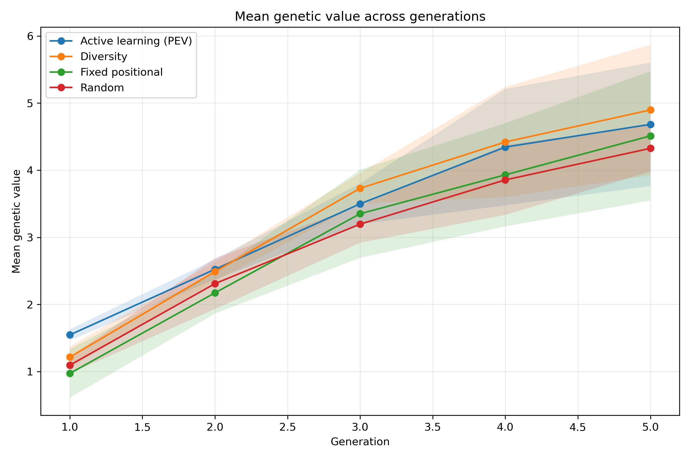
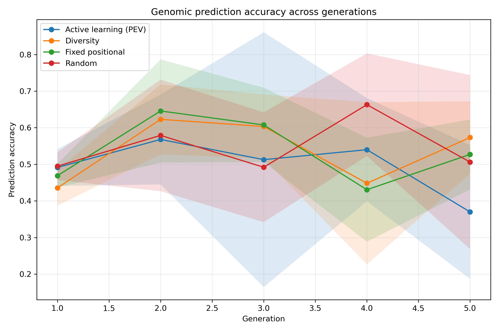
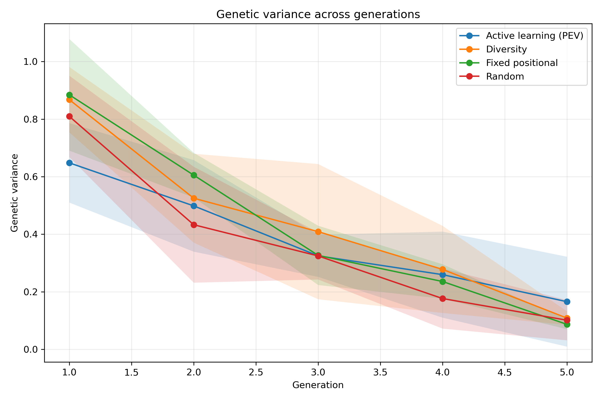
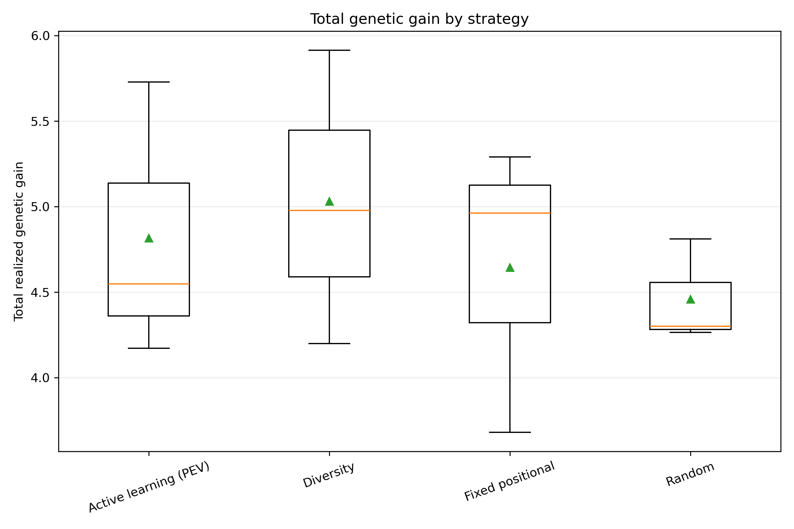
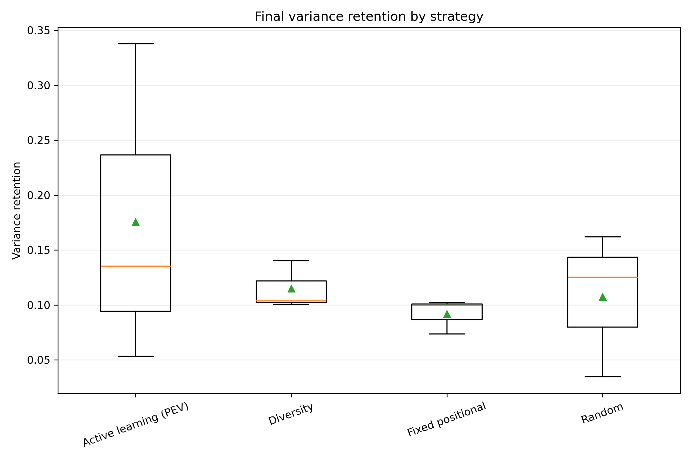
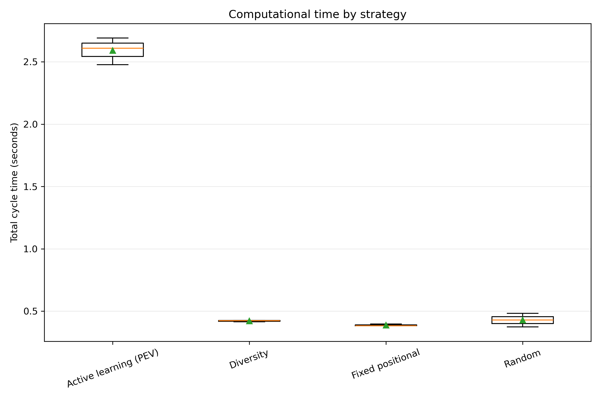
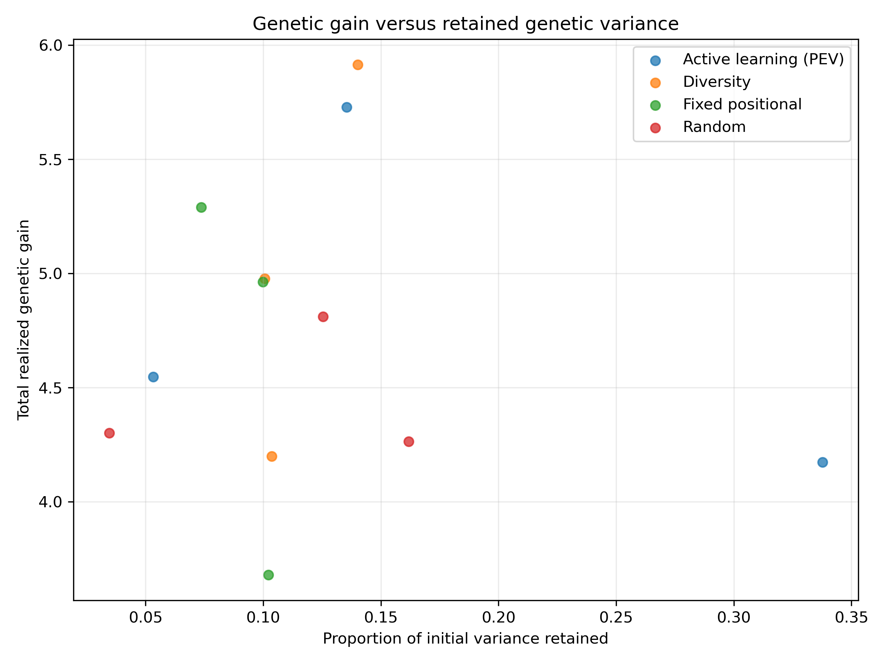

# Phenotyping Strategy Evaluation

## Evaluation design

The comparison contains 3 matched replicates, 5 breeding generations per replicate, and 4 strategies.

The strategies were evaluated using the same initial population, phenotyping budget, parent-selection rule, crossing design, and replicate seeds.

## Strategy summary

| strategy            |   replicates |   mean_total_gain |   median_total_gain |   mean_prediction_accuracy |   mean_final_variance |   mean_variance_retention |   mean_runtime_seconds |
|:--------------------|-------------:|------------------:|--------------------:|---------------------------:|----------------------:|--------------------------:|-----------------------:|
| diversity_sampling  |            3 |            5.0308 |              4.9784 |                     0.5367 |                0.1083 |                    0.1149 |                 0.4213 |
| active_learning_pev |            3 |            4.8166 |              4.5479 |                     0.4964 |                0.1655 |                    0.1755 |                 2.5922 |
| fixed_sampling      |            3 |            4.6444 |              4.963  |                     0.536  |                0.0866 |                    0.0919 |                 0.3872 |
| random_sampling     |            3 |            4.4589 |              4.3008 |                     0.547  |                0.1012 |                    0.1073 |                 0.4283 |

## Main descriptive result

The highest mean total realized genetic gain was observed for **diversity_sampling**, with a mean of 5.031.

This descriptive ranking should be interpreted together with the paired statistical tests and the retained genetic variance.

## Omnibus repeated-measures tests

| metric                      | test     |   number_of_replicates |   number_of_strategies |   statistic |   p_value |   kendalls_w |
|:----------------------------|:---------|-----------------------:|-----------------------:|------------:|----------:|-------------:|
| total_realized_genetic_gain | Friedman |                      3 |                      4 |         0.6 |   0.89643 |      0.06667 |
| final_mean_genetic_value    | Friedman |                      3 |                      4 |         0.6 |   0.89643 |      0.06667 |
| mean_prediction_accuracy    | Friedman |                      3 |                      4 |         1   |   0.80125 |      0.11111 |
| final_genetic_variance      | Friedman |                      3 |                      4 |         2.2 |   0.53195 |      0.24444 |
| variance_retention          | Friedman |                      3 |                      4 |         2.2 |   0.53195 |      0.24444 |
| total_cycle_seconds         | Friedman |                      3 |                      4 |         6.6 |   0.0858  |      0.73333 |

## Figures

### Mean Genetic Value

### Prediction Accuracy

### Genetic Variance

### Total Genetic Gain Boxplot

### Variance Retention Boxplot

### Runtime Boxplot

### Gain Variance Tradeoff

## Output tables

- `raw/generation_results.csv`: one row per strategy, replicate, and generation.
- `raw/replicate_results.csv`: one row per strategy and replicate.
- `processed/descriptive_statistics.csv`: summary statistics for each outcome.
- `processed/friedman_tests.csv`: overall repeated-measures tests.
- `processed/pairwise_tests.csv`: paired Wilcoxon tests with Holm correction and effect sizes.

## Interpretation cautions

The development comparison with only a few replicates is a pipeline check, not the final scientific analysis. Final conclusions should use a larger number of matched replicates. A strategy should not be judged on genetic gain alone because rapid gain may be accompanied by faster depletion of genetic variance.
