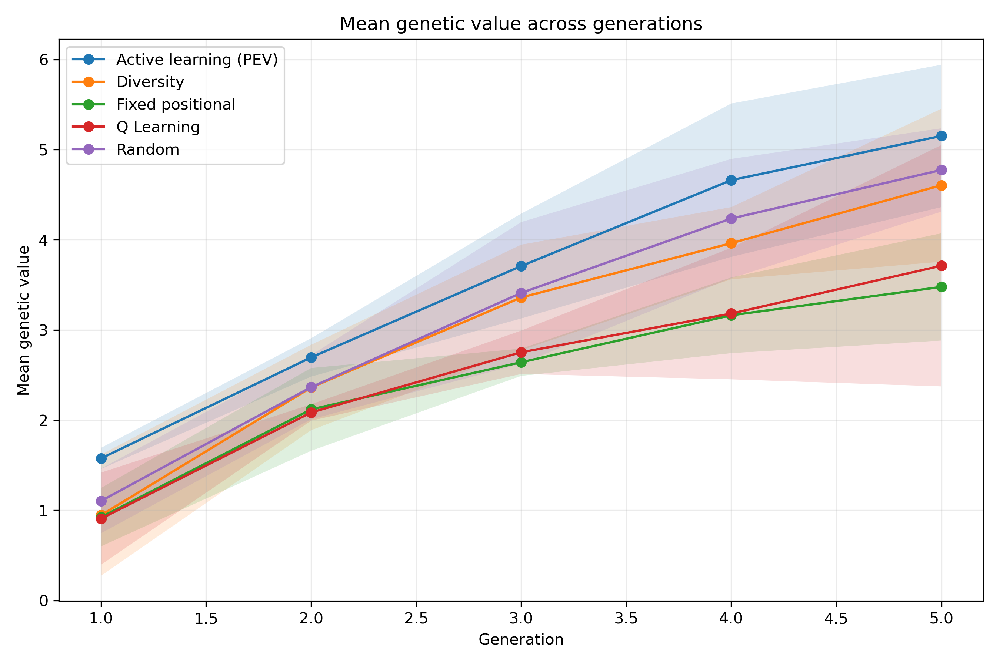
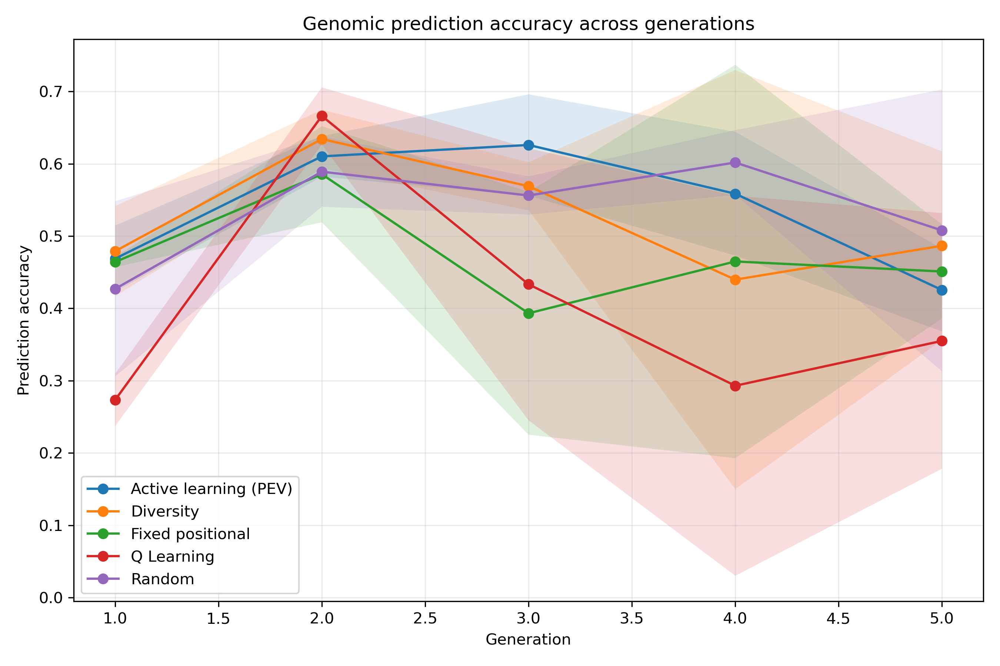
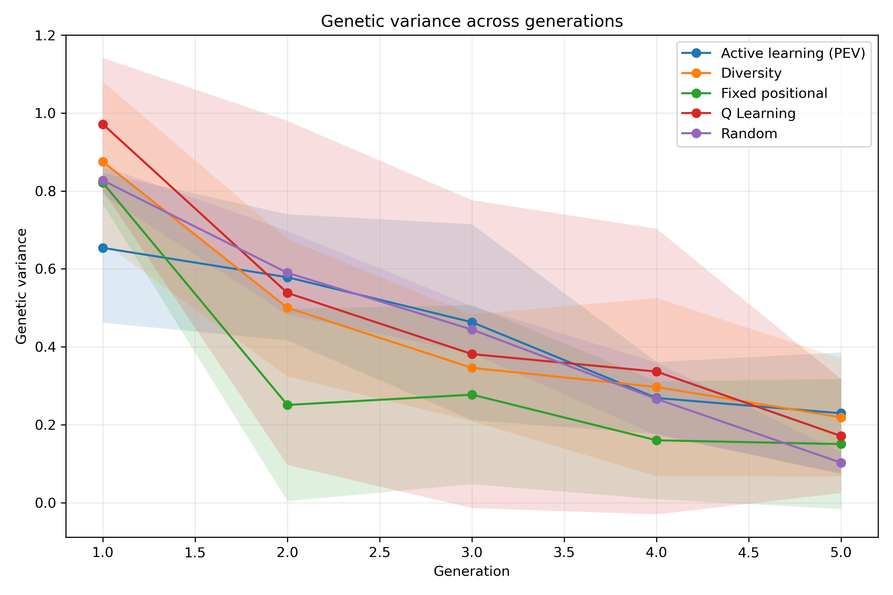
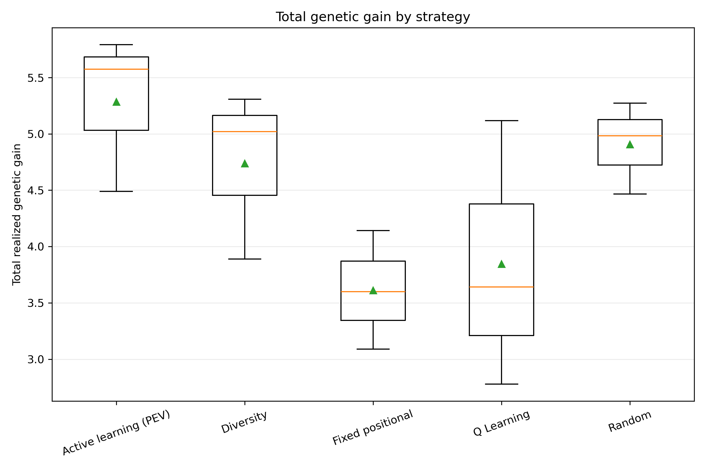
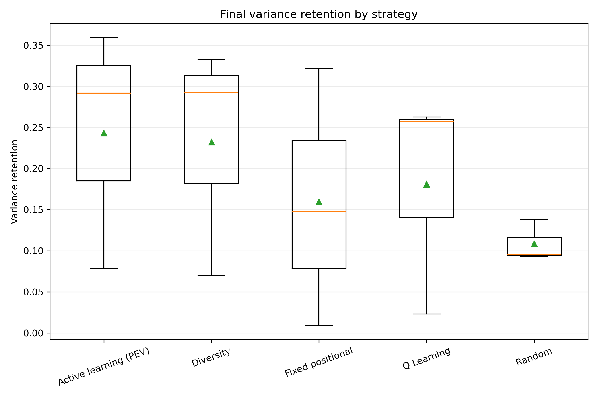
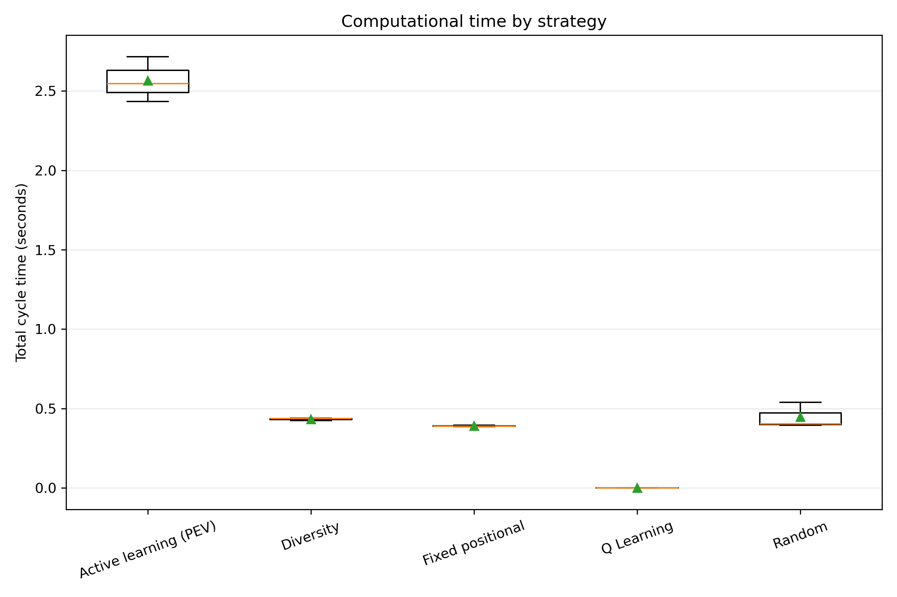
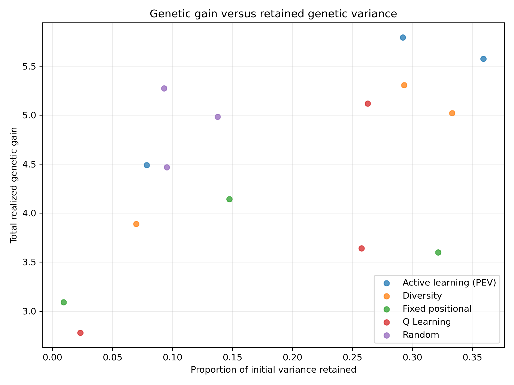

# Phenotyping Strategy Evaluation Including RL

## Evaluation design

The comparison contains 3 matched replicates, 5 breeding generations per replicate, and 5 strategies.

The strategies were evaluated using the same initial population, phenotyping budget, parent-selection rule, crossing design, and replicate seeds.

## Strategy summary

| strategy            |   replicates |   mean_total_gain |   median_total_gain |   mean_prediction_accuracy |   mean_final_variance |   mean_variance_retention |   mean_runtime_seconds |
|:--------------------|-------------:|------------------:|--------------------:|---------------------------:|----------------------:|--------------------------:|-----------------------:|
| active_learning_pev |            3 |            5.2846 |              5.5734 |                     0.5378 |                0.2293 |                    0.2431 |                 2.5645 |
| random_sampling     |            3 |            4.9073 |              4.9819 |                     0.5363 |                0.1025 |                    0.1087 |                 0.447  |
| diversity_sampling  |            3 |            4.7379 |              5.0189 |                     0.5217 |                0.2188 |                    0.232  |                 0.4338 |
| q_learning          |            3 |            3.8454 |              3.6409 |                     0.4042 |                0.1708 |                    0.1811 |                 0      |
| fixed_sampling      |            3 |            3.6107 |              3.5996 |                     0.4717 |                0.1503 |                    0.1594 |                 0.3906 |

## Main descriptive result

The highest mean total realized genetic gain was observed for **active_learning_pev**, with a mean of 5.285.

This descriptive ranking should be interpreted together with the paired statistical tests and the retained genetic variance.

## Omnibus repeated-measures tests

| metric                      | test     |   number_of_replicates |   number_of_strategies |   statistic |   p_value |   kendalls_w |
|:----------------------------|:---------|-----------------------:|-----------------------:|------------:|----------:|-------------:|
| total_realized_genetic_gain | Friedman |                      3 |                      5 |     4.8     |   0.30844 |      0.4     |
| final_mean_genetic_value    | Friedman |                      3 |                      5 |     4.8     |   0.30844 |      0.4     |
| mean_prediction_accuracy    | Friedman |                      3 |                      5 |     7.73333 |   0.10185 |      0.64444 |
| final_genetic_variance      | Friedman |                      3 |                      5 |     1.86667 |   0.76027 |      0.15556 |
| variance_retention          | Friedman |                      3 |                      5 |     1.86667 |   0.76027 |      0.15556 |
| total_cycle_seconds         | Friedman |                      3 |                      5 |    11.4667  |   0.02179 |      0.95556 |

## Figures

### Mean Genetic Value

### Prediction Accuracy

### Genetic Variance

### Total Genetic Gain Boxplot

### Variance Retention Boxplot

### Runtime Boxplot

### Gain Variance Tradeoff

## Output tables

- `raw/generation_results.csv`: one row per strategy, replicate, and generation.
- `raw/replicate_results.csv`: one row per strategy and replicate.
- `processed/descriptive_statistics.csv`: summary statistics for each outcome.
- `processed/friedman_tests.csv`: overall repeated-measures tests.
- `processed/pairwise_tests.csv`: paired Wilcoxon tests with Holm correction and effect sizes.

## Interpretation cautions

The development comparison with only a few replicates is a pipeline check, not the final scientific analysis. Final conclusions should use a larger number of matched replicates. A strategy should not be judged on genetic gain alone because rapid gain may be accompanied by faster depletion of genetic variance.
