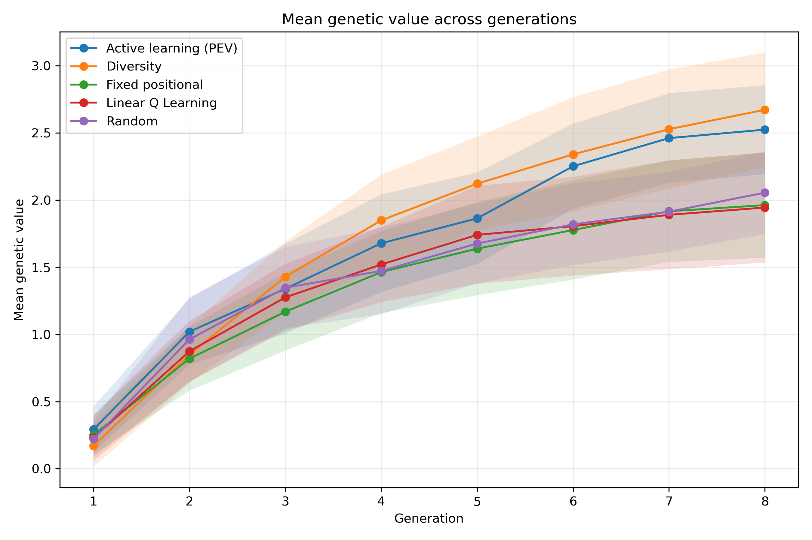
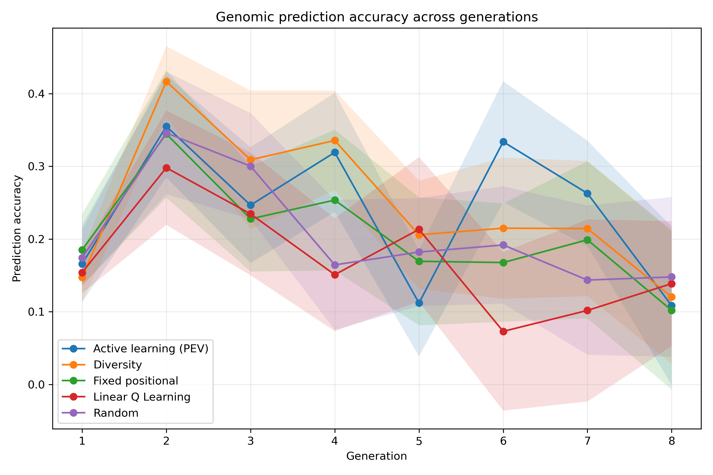
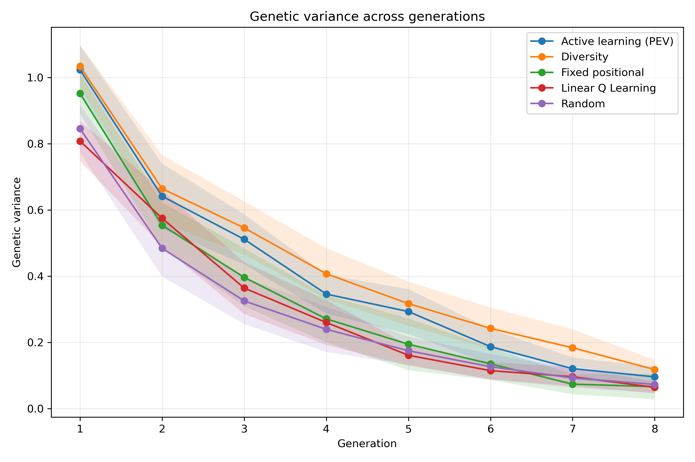
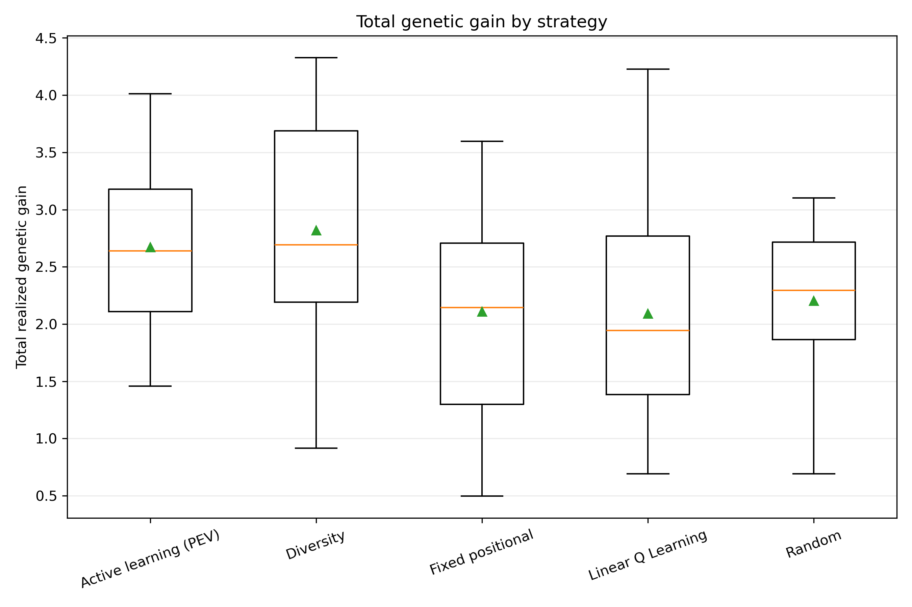
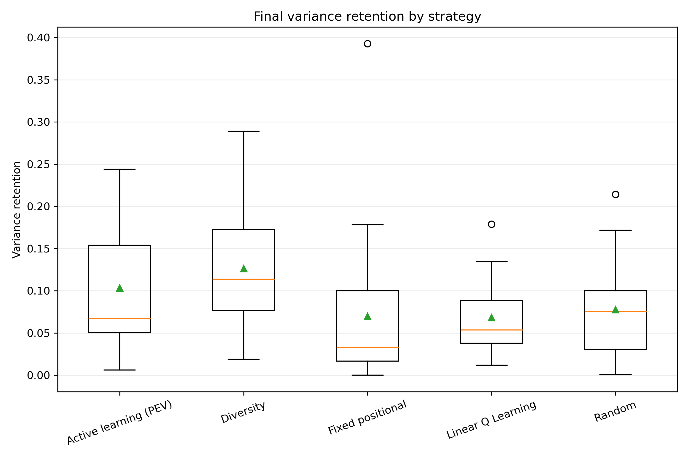
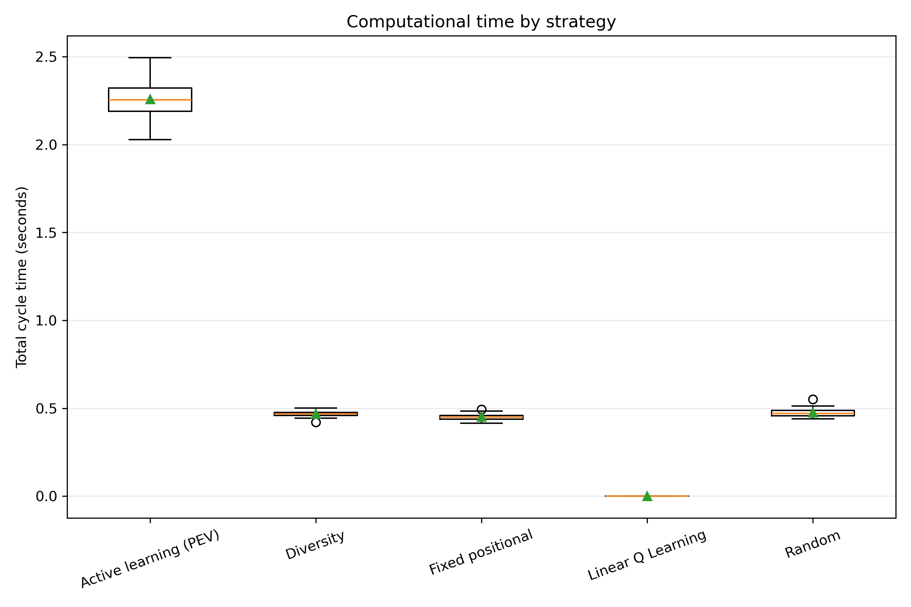
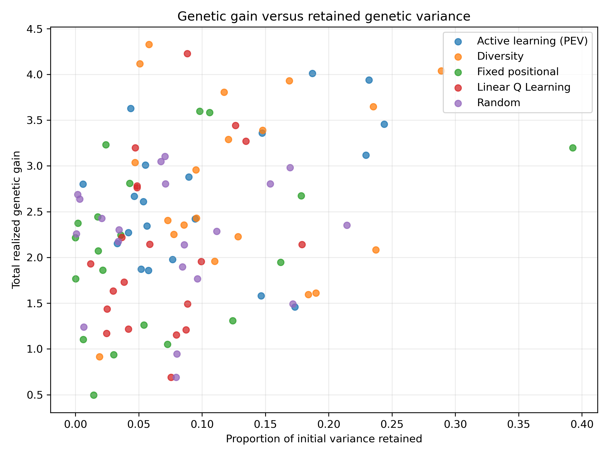

# Phenotyping Strategy Evaluation Including RL

## Evaluation design

The comparison contains 20 matched replicates, 8 breeding generations per replicate, and 5 strategies.

The strategies were evaluated using the same initial population, phenotyping budget, parent-selection rule, crossing design, and replicate seeds.

## Strategy summary

| strategy            |   replicates |   mean_total_gain |   median_total_gain |   mean_prediction_accuracy |   mean_final_variance |   mean_variance_retention |   mean_runtime_seconds |
|:--------------------|-------------:|------------------:|--------------------:|---------------------------:|----------------------:|--------------------------:|-----------------------:|
| diversity_sampling  |           20 |            2.8188 |              2.6932 |                     0.2455 |                0.1183 |                    0.1265 |                 0.4681 |
| active_learning_pev |           20 |            2.6709 |              2.6388 |                     0.2379 |                0.0963 |                    0.1033 |                 2.2579 |
| random_sampling     |           20 |            2.2017 |              2.2938 |                     0.2062 |                0.0732 |                    0.0779 |                 0.4757 |
| fixed_sampling      |           20 |            2.109  |              2.1433 |                     0.2054 |                0.0666 |                    0.07   |                 0.4514 |
| linear_q_learning   |           20 |            2.0908 |              1.9429 |                     0.1705 |                0.0644 |                    0.0685 |                 0      |

## Main descriptive result

The highest mean total realized genetic gain was observed for **diversity_sampling**, with a mean of 2.819.

This descriptive ranking should be interpreted together with the paired statistical tests and the retained genetic variance.

## Omnibus repeated-measures tests

| metric                      | test     |   number_of_replicates |   number_of_strategies |   statistic |   p_value |   kendalls_w |
|:----------------------------|:---------|-----------------------:|-----------------------:|------------:|----------:|-------------:|
| total_realized_genetic_gain | Friedman |                     20 |                      5 |        7.48 |   0.11259 |       0.0935 |
| final_mean_genetic_value    | Friedman |                     20 |                      5 |        7.48 |   0.11259 |       0.0935 |
| mean_prediction_accuracy    | Friedman |                     20 |                      5 |       12.16 |   0.0162  |       0.152  |
| final_genetic_variance      | Friedman |                     20 |                      5 |        9.56 |   0.04853 |       0.1195 |
| variance_retention          | Friedman |                     20 |                      5 |        9.56 |   0.04853 |       0.1195 |
| total_cycle_seconds         | Friedman |                     20 |                      5 |       69.92 |   0       |       0.874  |

## Figures

### Mean Genetic Value

### Prediction Accuracy

### Genetic Variance

### Total Genetic Gain Boxplot

### Variance Retention Boxplot

### Runtime Boxplot

### Gain Variance Tradeoff

## Output tables

- `raw/generation_results.csv`: one row per strategy, replicate, and generation.
- `raw/replicate_results.csv`: one row per strategy and replicate.
- `processed/descriptive_statistics.csv`: summary statistics for each outcome.
- `processed/friedman_tests.csv`: overall repeated-measures tests.
- `processed/pairwise_tests.csv`: paired Wilcoxon tests with Holm correction and effect sizes.

## Interpretation cautions

The development comparison with only a few replicates is a pipeline check, not the final scientific analysis. Final conclusions should use a larger number of matched replicates. A strategy should not be judged on genetic gain alone because rapid gain may be accompanied by faster depletion of genetic variance.
