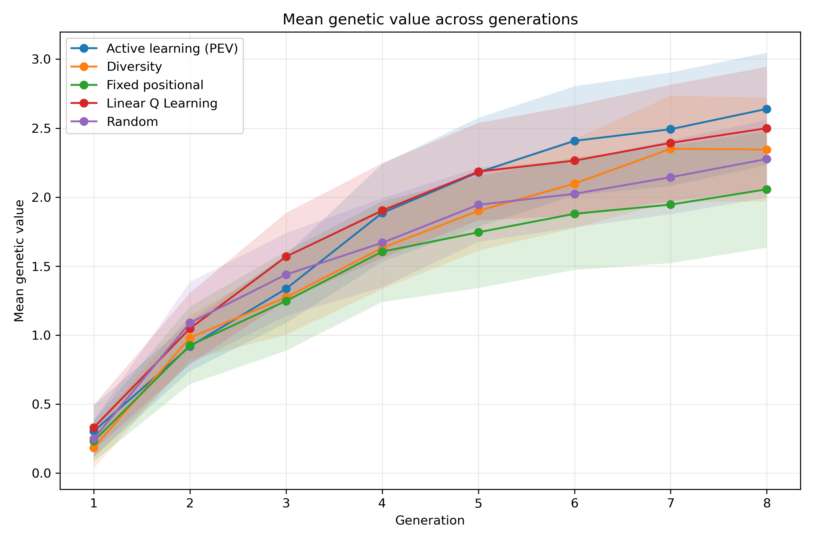
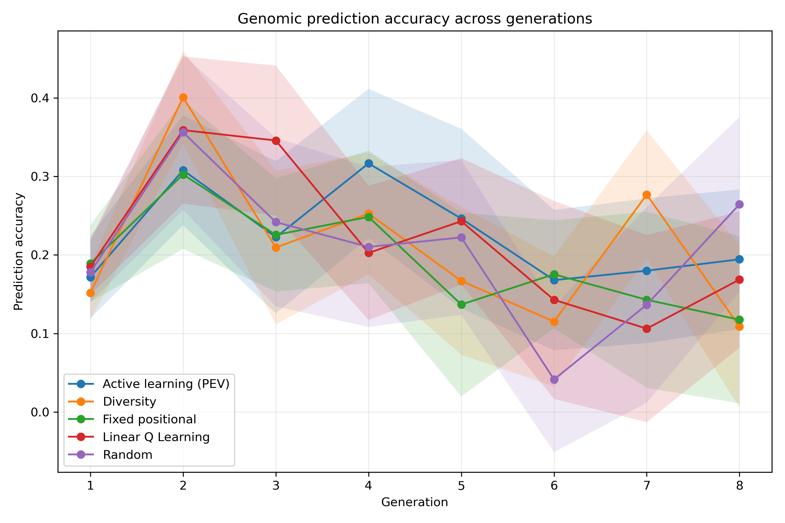
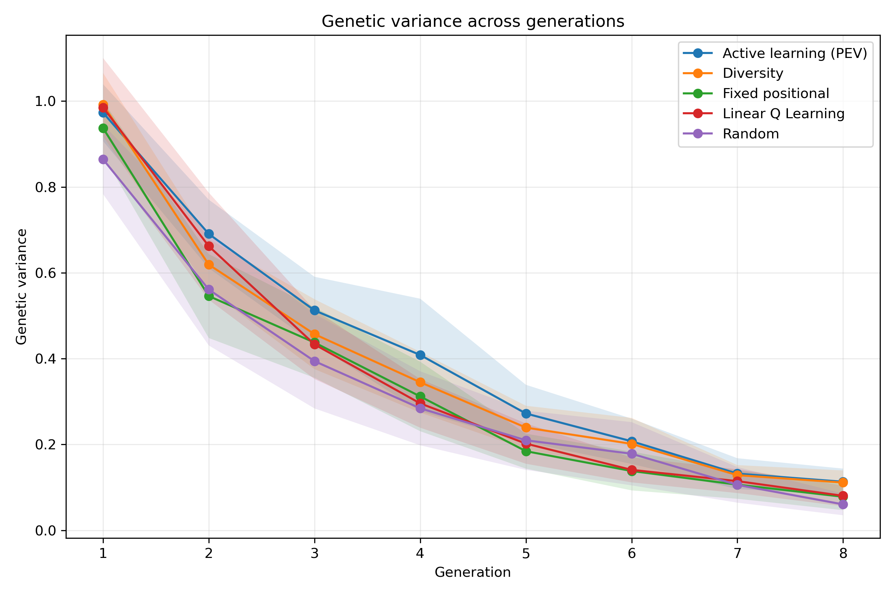
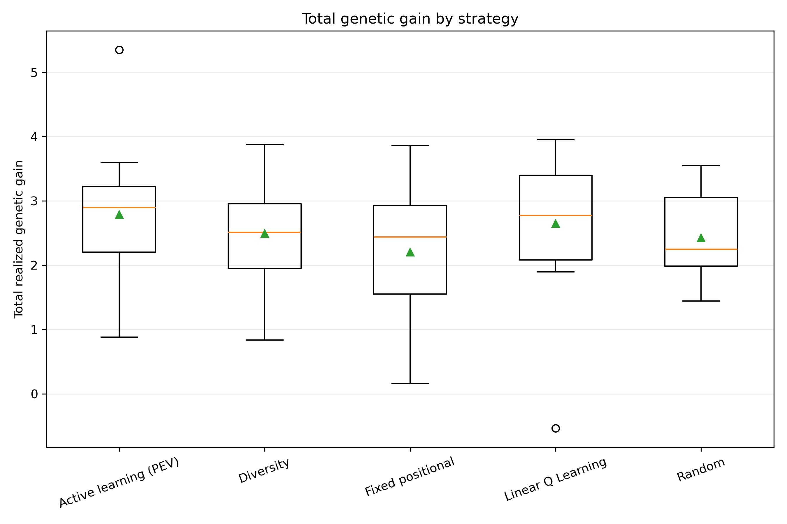
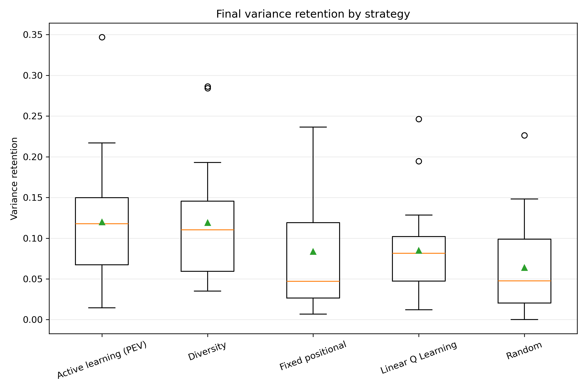
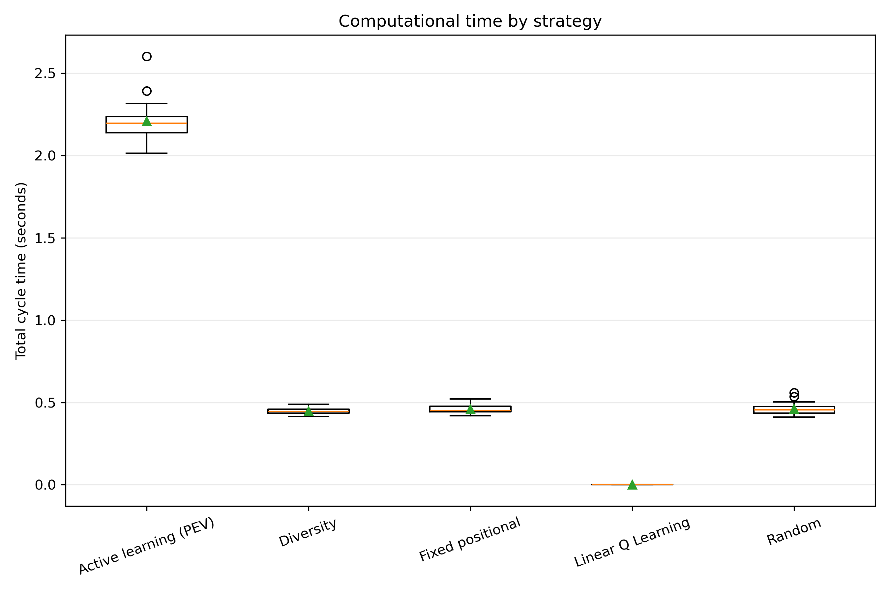
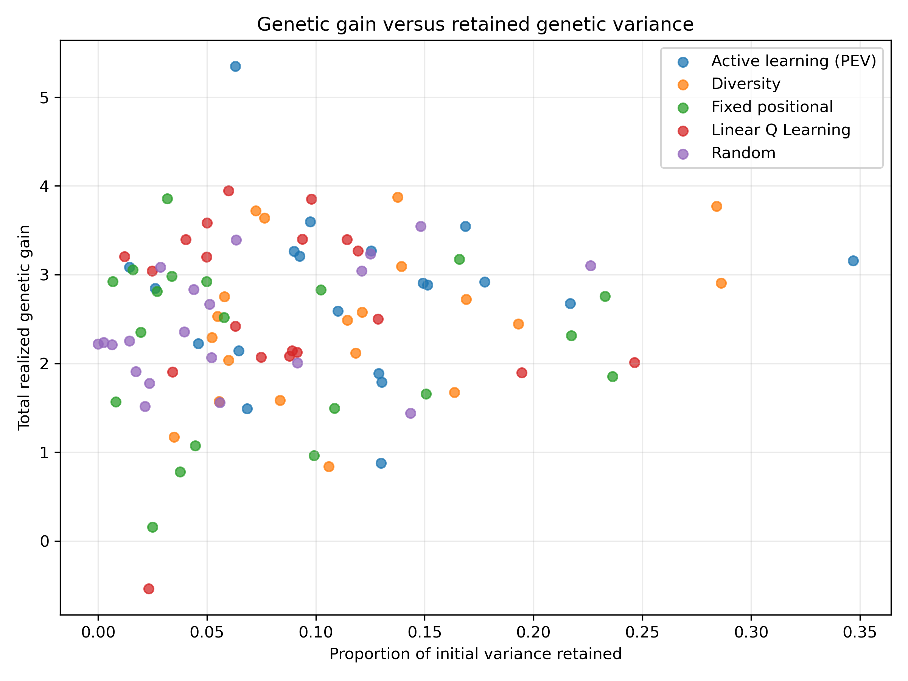

# Phenotyping Strategy Evaluation Including RL

## Evaluation design

The comparison contains 20 matched replicates, 8 breeding generations per replicate, and 5 strategies.

The strategies were evaluated using the same initial population, phenotyping budget, parent-selection rule, crossing design, and replicate seeds.

## Strategy summary

| strategy            |   replicates |   mean_total_gain |   median_total_gain |   mean_prediction_accuracy |   mean_final_variance |   mean_variance_retention |   mean_runtime_seconds |
|:--------------------|-------------:|------------------:|--------------------:|---------------------------:|----------------------:|--------------------------:|-----------------------:|
| active_learning_pev |           20 |            2.7859 |              2.8952 |                     0.226  |                0.1131 |                    0.1199 |                 2.2075 |
| linear_q_learning   |           20 |            2.6461 |              2.7719 |                     0.2191 |                0.0803 |                    0.0848 |                 0      |
| diversity_sampling  |           20 |            2.491  |              2.5106 |                     0.2103 |                0.1112 |                    0.1191 |                 0.4467 |
| random_sampling     |           20 |            2.4229 |              2.2456 |                     0.2048 |                0.0604 |                    0.0638 |                 0.4611 |
| fixed_sampling      |           20 |            2.2032 |              2.436  |                     0.1923 |                0.0782 |                    0.0836 |                 0.4593 |

## Main descriptive result

The highest mean total realized genetic gain was observed for **active_learning_pev**, with a mean of 2.786.

This descriptive ranking should be interpreted together with the paired statistical tests and the retained genetic variance.

## Omnibus repeated-measures tests

| metric                      | test     |   number_of_replicates |   number_of_strategies |   statistic |   p_value |   kendalls_w |
|:----------------------------|:---------|-----------------------:|-----------------------:|------------:|----------:|-------------:|
| total_realized_genetic_gain | Friedman |                     20 |                      5 |        2.6  |   0.62682 |       0.0325 |
| final_mean_genetic_value    | Friedman |                     20 |                      5 |        2.6  |   0.62682 |       0.0325 |
| mean_prediction_accuracy    | Friedman |                     20 |                      5 |        4.12 |   0.39001 |       0.0515 |
| final_genetic_variance      | Friedman |                     20 |                      5 |       10.52 |   0.03252 |       0.1315 |
| variance_retention          | Friedman |                     20 |                      5 |       10.52 |   0.03252 |       0.1315 |
| total_cycle_seconds         | Friedman |                     20 |                      5 |       64.36 |   0       |       0.8045 |

## Figures

### Mean Genetic Value

### Prediction Accuracy

### Genetic Variance

### Total Genetic Gain Boxplot

### Variance Retention Boxplot

### Runtime Boxplot

### Gain Variance Tradeoff

## Output tables

- `raw/generation_results.csv`: one row per strategy, replicate, and generation.
- `raw/replicate_results.csv`: one row per strategy and replicate.
- `processed/descriptive_statistics.csv`: summary statistics for each outcome.
- `processed/friedman_tests.csv`: overall repeated-measures tests.
- `processed/pairwise_tests.csv`: paired Wilcoxon tests with Holm correction and effect sizes.

## Interpretation cautions

The development comparison with only a few replicates is a pipeline check, not the final scientific analysis. Final conclusions should use a larger number of matched replicates. A strategy should not be judged on genetic gain alone because rapid gain may be accompanied by faster depletion of genetic variance.
