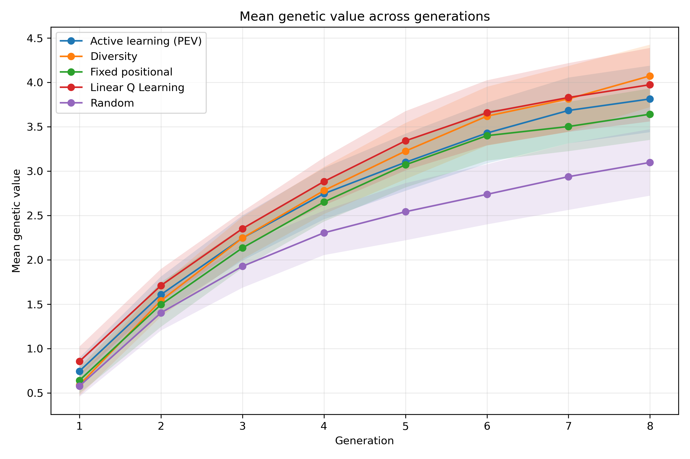
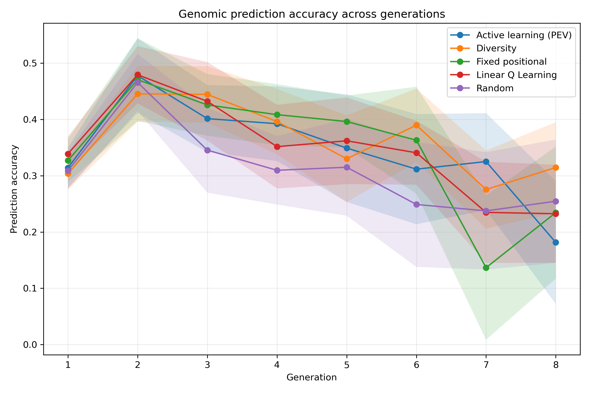
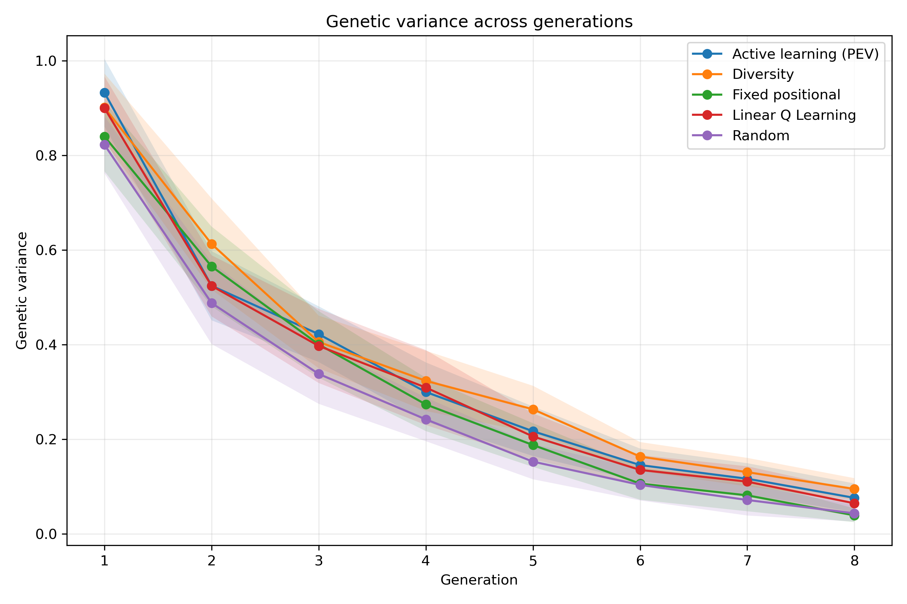
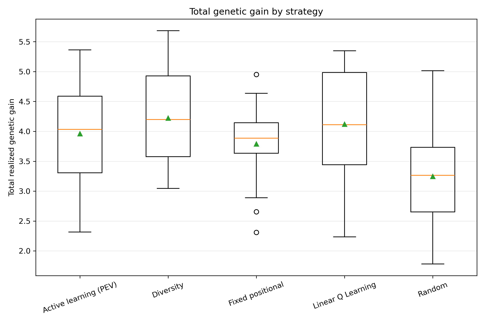
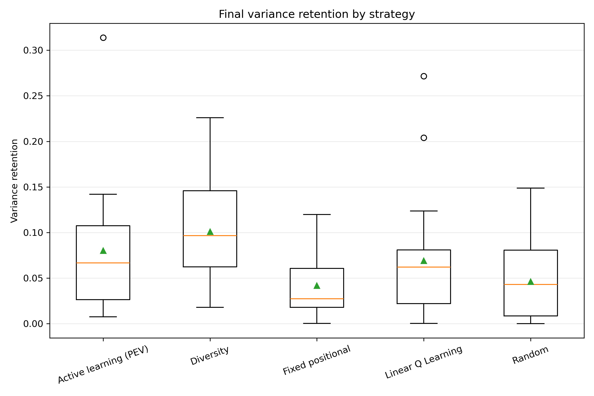
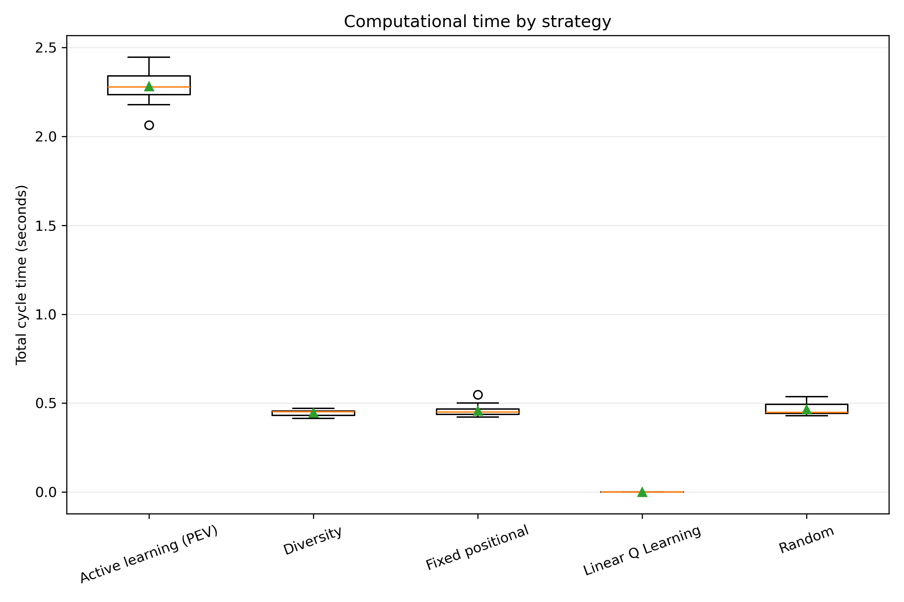
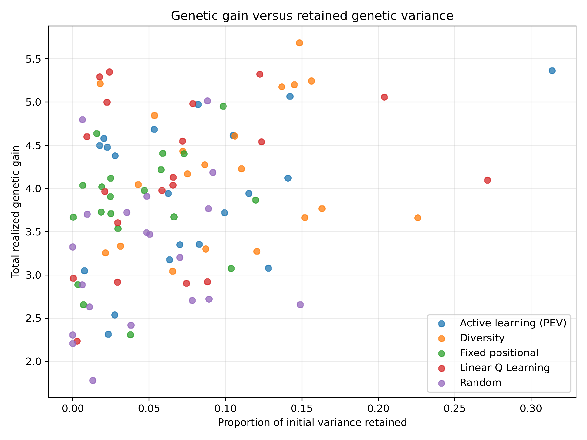

# Phenotyping Strategy Evaluation Including RL

## Evaluation design

The comparison contains 20 matched replicates, 8 breeding generations per replicate, and 5 strategies.

The strategies were evaluated using the same initial population, phenotyping budget, parent-selection rule, crossing design, and replicate seeds.

## Strategy summary

| strategy            |   replicates |   mean_total_gain |   median_total_gain |   mean_prediction_accuracy |   mean_final_variance |   mean_variance_retention |   mean_runtime_seconds |
|:--------------------|-------------:|------------------:|--------------------:|---------------------------:|----------------------:|--------------------------:|-----------------------:|
| diversity_sampling  |           20 |            4.2207 |              4.1994 |                     0.3624 |                0.0951 |                    0.1009 |                 0.446  |
| linear_q_learning   |           20 |            4.1215 |              4.1118 |                     0.3464 |                0.0648 |                    0.069  |                 0      |
| active_learning_pev |           20 |            3.961  |              4.0324 |                     0.3441 |                0.0763 |                    0.0803 |                 2.2823 |
| fixed_sampling      |           20 |            3.7889 |              3.8864 |                     0.3452 |                0.0394 |                    0.0418 |                 0.4582 |
| random_sampling     |           20 |            3.2451 |              3.2633 |                     0.3075 |                0.0436 |                    0.0461 |                 0.4658 |

## Main descriptive result

The highest mean total realized genetic gain was observed for **diversity_sampling**, with a mean of 4.221.

This descriptive ranking should be interpreted together with the paired statistical tests and the retained genetic variance.

## Omnibus repeated-measures tests

| metric                      | test     |   number_of_replicates |   number_of_strategies |   statistic |   p_value |   kendalls_w |
|:----------------------------|:---------|-----------------------:|-----------------------:|------------:|----------:|-------------:|
| total_realized_genetic_gain | Friedman |                     20 |                      5 |       10.88 |   0.02795 |       0.136  |
| final_mean_genetic_value    | Friedman |                     20 |                      5 |       10.88 |   0.02795 |       0.136  |
| mean_prediction_accuracy    | Friedman |                     20 |                      5 |        5.6  |   0.23108 |       0.07   |
| final_genetic_variance      | Friedman |                     20 |                      5 |       15.08 |   0.00454 |       0.1885 |
| variance_retention          | Friedman |                     20 |                      5 |       15.08 |   0.00454 |       0.1885 |
| total_cycle_seconds         | Friedman |                     20 |                      5 |       64.16 |   0       |       0.802  |

## Figures

### Mean Genetic Value

### Prediction Accuracy

### Genetic Variance

### Total Genetic Gain Boxplot

### Variance Retention Boxplot

### Runtime Boxplot

### Gain Variance Tradeoff

## Output tables

- `raw/generation_results.csv`: one row per strategy, replicate, and generation.
- `raw/replicate_results.csv`: one row per strategy and replicate.
- `processed/descriptive_statistics.csv`: summary statistics for each outcome.
- `processed/friedman_tests.csv`: overall repeated-measures tests.
- `processed/pairwise_tests.csv`: paired Wilcoxon tests with Holm correction and effect sizes.

## Interpretation cautions

The development comparison with only a few replicates is a pipeline check, not the final scientific analysis. Final conclusions should use a larger number of matched replicates. A strategy should not be judged on genetic gain alone because rapid gain may be accompanied by faster depletion of genetic variance.
